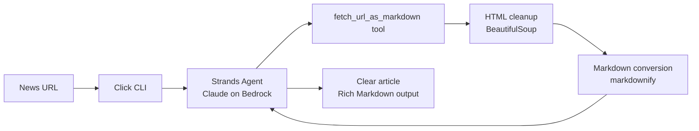
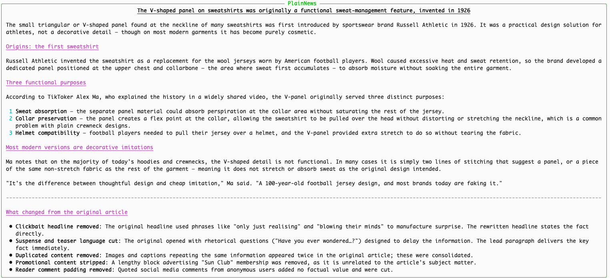

# Removing Clickbait from News Articles with an AI Agent, Python, Strands Agents, and AWS Bedrock

The web is full of articles that do not want to tell you what happened too soon. The headline hints at something. The first paragraphs add suspense. The useful information is somewhere below the fold, after the cookie banner, the newsletter box, a couple of related links, and enough scrolling to make the advertising model happy.

That is annoying when all we want is the news.

That's my PoC. A small command-line application that receives the URL of a news article, converts the page into clean Markdown, and asks an AI agent to rewrite it as clear journalism: direct headline, concise lead, short paragraphs, no clickbait.


The idea is simple:

```bash
plainnews rewrite "https://example.com/news/article"
```

The CLI does not scrape the page directly. It gives the URL to a Strands Agent. The agent has one tool, `fetch_url_as_markdown`, and the model decides when to use it. Once the article is available as Markdown, the agent rewrites it following a focused system prompt.

## The architecture

The flow is straightforward:



The important part is the boundary between the agent and the tool. Fetching a web page, removing navigation, and converting HTML into Markdown is deterministic Python code. Deciding how to rewrite the story is the LLM's job.

This keeps the PoC small and easy to reason about.

## Project structure

I like to keep configuration in `settings.py`. It is a pattern I borrowed years ago from Django and I still use it in small prototypes because it keeps things simple:

```text
src/plainnews/
  cli.py
  settings.py
  commands/
    rewrite.py
  lib/
    agent.py
    prompts.py
    tools.py
    ui.py
  env/
    local/
      .env.example
tests/
```

The responsibilities are intentionally small:

- `plainnews/commands/rewrite.py` contains the Click command.
- `plainnews/lib/tools.py` contains the Strands tool and the HTML-to-Markdown pipeline.
- `plainnews/lib/agent.py` wires Strands Agents with AWS Bedrock.
- `plainnews/lib/prompts.py` keeps the editor prompt and the user task prompt.
- `plainnews/lib/ui.py` renders Markdown in the terminal with Rich.

## Fetching a URL as Markdown

The agent only gets one tool. It fetches the URL, removes noisy page elements, selects the main content, converts it to Markdown, and truncates the result to 100K characters:

```python
@tool
def fetch_url_as_markdown(url: str) -> str:
    """
    Fetch an HTTP or HTTPS URL, remove navigation, ads, scripts and layout noise,
    extract the main article content, convert it to Markdown, and return up to
    100K characters of clean text.

    Use this tool when the user pastes a URL or asks you to analyze a web page.
    """

    return fetch_url_as_markdown_impl(url)
```

The implementation is deliberately boring:

```python
def clean_html_to_markdown(html: str, *, max_chars: int = 100_000) -> str:
    soup = BeautifulSoup(html, "html.parser")

    for selector in NOISY_SELECTORS:
        for tag in soup.select(selector):
            tag.decompose()

    content = soup.find("main") or soup.find("article") or soup.body
    if content is None:
        return ""

    markdown = md(str(content), heading_style="ATX", bullets="-", strip=["a"])
    markdown = normalize_markdown(markdown)

    if len(markdown) > max_chars:
        return markdown[:max_chars].rstrip() + "\n\n[Content truncated]"

    return markdown
```

I am not trying to build a perfect browser engine here. This is a PoC. The goal is to get enough readable article content for the agent to work with. For many news pages, removing scripts, navigation, cookie boxes, newsletter blocks, related links and advertising containers is enough.

## The agent

The agent uses Claude on AWS Bedrock through Strands Agents:

```python
def create_agent(*, settings: Settings) -> Agent:
    boto_session = create_boto_session(settings)

    return Agent(
        model=BedrockModel(
            boto_session=boto_session,
            model_id=settings.resolved_bedrock_model_id,
        ),
        tools=[fetch_url_as_markdown],
        system_prompt=SYSTEM_PROMPT,
    )
```

The system prompt is the editorial policy. It tells the model to preserve only facts supported by the fetched article, answer in the requested output language, put the most important information first, remove suspense and filler, and write in a neutral tone.

The output format is Markdown:

- a direct H1 headline
- a concise lead paragraph
- short factual paragraphs
- a final `What changed` section, translated to the requested output language, explaining
  what noise was removed

That last section is useful during development. It gives us a quick sanity check: did the model actually remove clickbait, or did it just paraphrase the article?

## The CLI

The command is intentionally small:

```python
@click.command(name="rewrite")
@click.argument("url")
@runtime_options
def rewrite_command(
    url: str,
    aws_profile: str | None,
    region: str | None,
    model: str | None,
    language: str,
) -> None:
    if not is_supported_url(url):
        raise click.ClickException("URL must start with http:// or https://")

    settings = resolve_settings(
        aws_profile=aws_profile,
        aws_region=region,
        bedrock_model_id=model,
    )
    agent = create_agent(settings=settings)
    result = agent(build_rewrite_prompt(url, language=language))

    print_result("PlainNews", str(result))
```

The CLI validates the URL, creates the agent, sends the URL in the prompt, and renders the final Markdown with Rich.

The tool is not called manually from the command. That is the point of this PoC: the URL is part of the task, and the agent decides to call `fetch_url_as_markdown` because the tool description says it should be used when the user pastes a URL or asks to analyze a web page.

## Usage

Run the command:

```bash
poetry run plainnews rewrite "https://example.com/news/article"
```

By default, PlainNews writes the rewritten article in English. You can choose a
different output language with `--language`:

```bash
poetry run plainnews rewrite "https://example.com/news/article" --language Spanish
```

The output is rendered as Markdown in the terminal.

Example terminal output:




## Tech stack

- **Python** with Poetry
- **Strands Agents** for tool-based agent orchestration
- **AWS Bedrock** for the LLM runtime
- **BeautifulSoup** for HTML cleanup
- **markdownify** for HTML-to-Markdown conversion
- **Click** for the command-line interface
- **Rich** for Markdown terminal rendering
- **pytest** for tests

## A couple of notes

This is not a product and it is not a universal paywall remover. It is a small agentic workflow for a very specific frustration: articles that make readers work too hard to understand the basic facts.


Even in this small version, the pattern is useful: deterministic Python code prepares clean context, and the AI agent performs the editorial rewrite with a tight prompt.

And that's all. Full source code available on [GitHub](https://github.com/gonzalo123/plainnews).
